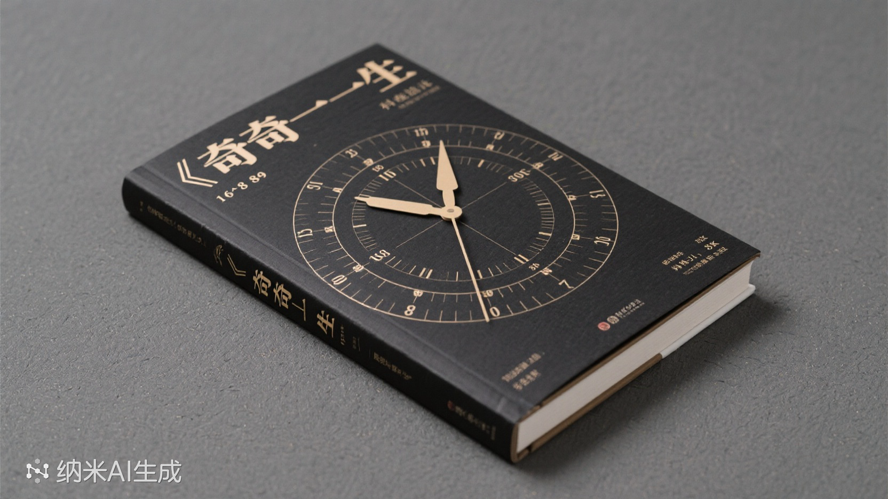
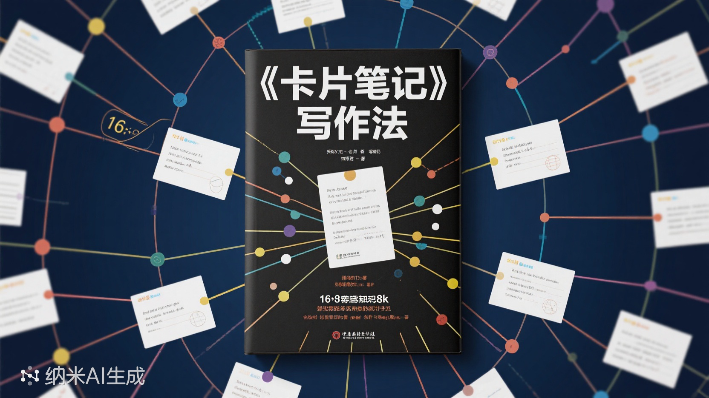
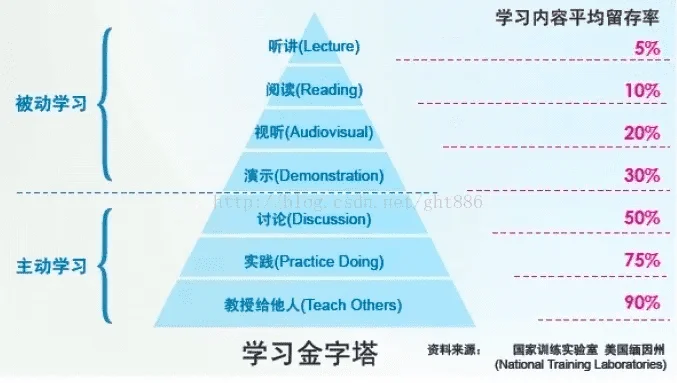
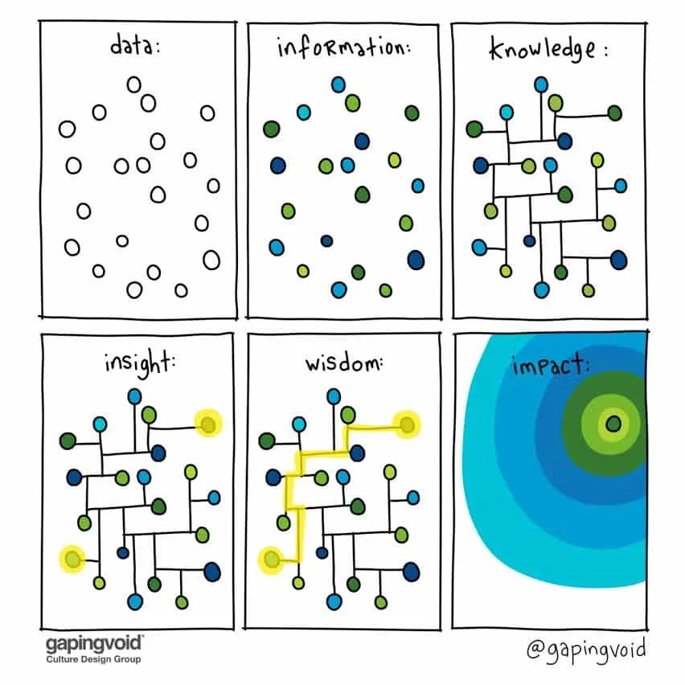
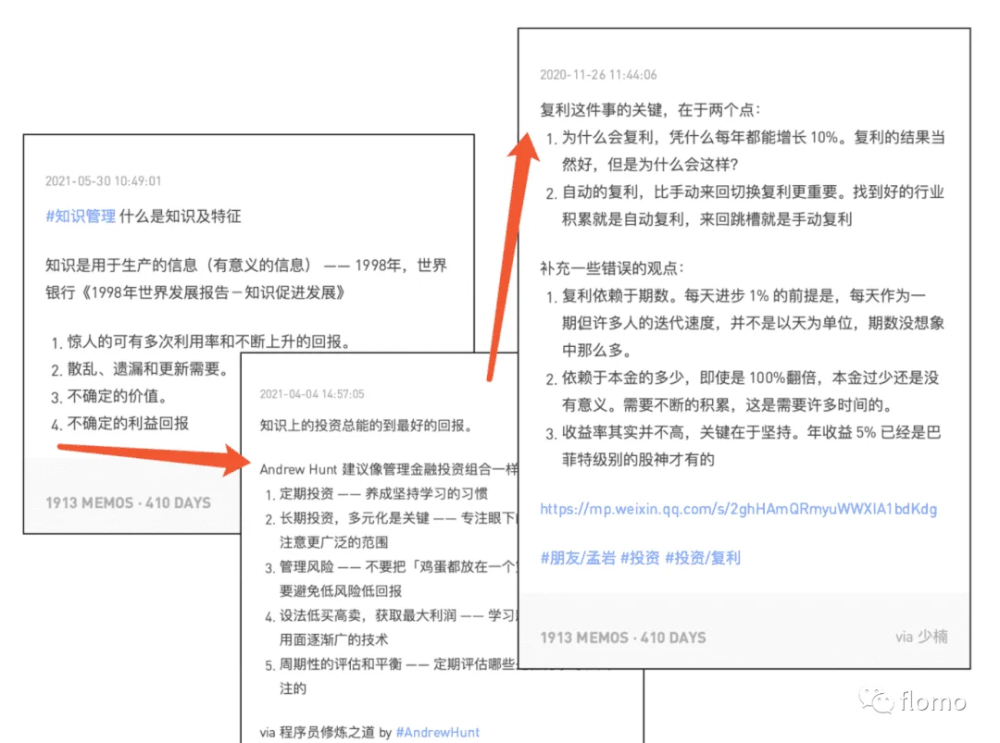
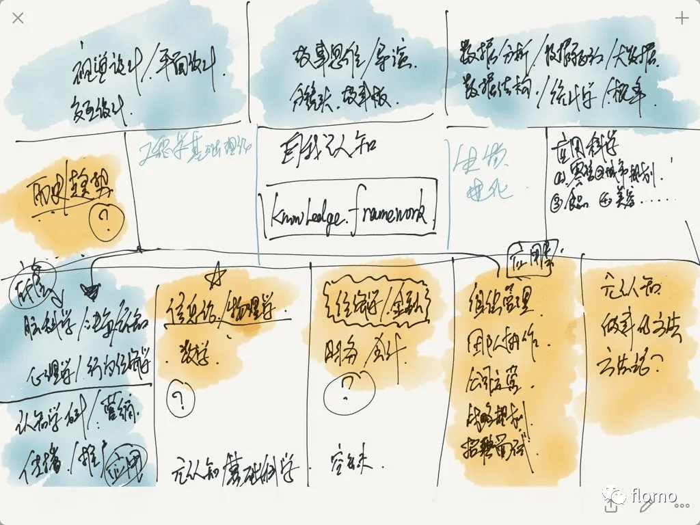

**《奇特的一生》** ⭐️⭐️⭐️
- **作者**：达尼伊尔·格拉宁
- **出版时间**：1979年
- **类型**：传记/非虚构
- **核心主题**：时间统计法与个人生产力管理

**《卡片笔记写作法》** ⭐️⭐️⭐️⭐️

- **作者**：申克·阿伦斯
- **出版时间**：2017年（德语原版），2020年中文版
- **类型**：方法论/非虚构
- **核心主题**：卢曼卡片盒笔记法与知识管理

## Why
此时
此书

## 奇特的一生

苏联作家格拉宁为生物学家柳比歇夫（Alexander Lyubishchev）1916 - 1972 创作的传记，核心在于介绍他独创的"时间统计法"——通过56年如一日记录时间开销

**历史背景 - 8小时工作制推行时间**：

- **苏联**：1917年革命后立即推行8小时制，影响社会主义国家
- **欧洲**：德国（1918）、法国（1919）等战后立法确认
- **中国**：1949年后在《劳动法》中确立8小时工作制
 

### 一些方法
1. 将时间支出分为两类：

- 纯工作时间（专注研究、写作等创造性活动）
- 非核心时间（会议、社交、家务等）

2. 每晚统计时间消耗，月末汇总分析，年底撰写年度报告（如1963年他统计出全年有效工作达1906小时，平均每天5.1小时）。

3. 他一生积累了超过5万小时的纯学术时间（相当于每天3小时持续50年）。 84岁临终前仍在工作

1943年7月14日
理论工作：物种形成的数学模型 —— 1h45m（效率评分：A-，后45分钟被敲门打断）
校对《蚜虫分类手稿》 —— 58m（错误率：2处/千字）

与生态学家И.А.基里洛夫讨论物种竞争模型 —— 1h15m
产出：修正论文公式（3处错误避免）
效率评分：A（明确议题，无闲聊）

参加研究所周年聚餐 —— 2h40m
有效交流：12m（与年轻学者讨论蚜虫标本采集）
其余时间：被迫听领导讲话（38m）、重复性寒暄（50m）

--- "此类活动回报率≤15%，1964年起仅出席前30分钟。"

1970年8月7日
晨泳（1.5公里） —— 28m（心率140，恢复良好）
午休（严格20分钟） —— 20m（无超时）

1965年4月9日
计划任务：《科学史》第三章撰写
实际执行：1h10m（被同事打断2次，共损失25m）
复盘：下次写作期间关闭办公室门
调整方案：
重要任务时段设为"免打扰模式"（09:00-11:00）
预留"缓冲时间"应付突发事件

1965年圣诞节
妹妹全家来访 —— 5h30m
有效时段：1h（甥女请教数学问题）
无效时段：4.5h（家长里短，电视噪音）
批注：
"血缘义务需履行，但明年改为单独约甥女去图书馆辅导。"

1937年：
柳比歇夫（时年约41岁）已在昆虫分类学领域取得显著成就，研究所高层提议由他接任行政职务。
他的计算：
通过时间统计法预估，担任所长后：
每周需耗费30-40小时处理行政事务（会议、签字、人事协调）。
实际科研时间将从每周50小时锐减至15小时（下降70%）。
**结论：行政工作与个人研究目标冲突，果断拒绝。**

**二战时在防空洞仍坚持每日3小时科研（用时间记录对抗战争混乱）。**

### 成果统计

**学术产出**：
- 一生发表70余部学术著作
- 研究涉及生物学、数学、哲学等多个领域
- 留下大量待整理手稿

**阅读量**：
- 仅1967年就阅读俄文书48本、外文书10本
- 撰写12篇论文和550页书稿

**时间复利**：
- 通过严格记录发现，每天纯工作时间超过4小时已属高效
- 反对盲目追求"忙碌"

**跨学科贡献**：
| 领域 | 具体贡献 |
|------|----------|
| **数学** | 研究生物统计学中的概率问题，提出"形态测量学"新方法（如用几何学分析昆虫形态演化） |
| **科学史** | 撰写《科学史中的方法论问题》，探讨伽利略、牛顿等科学家的思维模式 |
| **哲学** | 对"时间本质"的哲学思考（直接启发其时间统计法） |
| **语言学** | 精通多国语言，翻译英、德、法学术文献，甚至研究古斯拉夫语语法 |
| **文学批评** | 出版《陀思妥耶夫斯基的三重辩证法》等文学分析著作 |

**终身学习者的圣经**
"五等分时间分配法"（科研/阅读/社交/生活/兴趣均衡）成为FIRE（财务自由早期退休）运动者的时间模板
案例：一位MIT教授模仿其方法，用10年业余时间自学成建筑史专家并出版专著

### 核心启示

**柳比歇夫证明了两个重要观点**：

- **通才≠浅薄**：通过系统性时间投入，可在多领域达到专业级水平
- **学科边界是人为的**：他的研究始终围绕"生命系统的规律"这一核心问题，数学、哲学只是工具
- **清醒活着和长期主义** 找到目标，通过诚实记录，看清自己如何消耗生命，从而主动选择价值所在

### 个人感受
对时间更敏感

### 争议点：这种方法是否过于机械？

## 卡片笔记写做法
德国社会学家尼克拉斯·卢曼如何通过“卡片盒笔记法”（Zettelkasten），在没有学位背景的情况下，成为20世纪最具影响力的社会学家之一。他的方法核心在于：记录灵感、建立连接、形成网络、涌现新知。该书不仅是一本笔记方法指南，更是一套完整的知识管理体系。

成果 
凭借卡片笔记写作法（Zettelkasten）高效输出了大量跨学科著作，并在社会学、系统理论等领域提出了开创性观点。以下是他的主要学术成果和贡献：

- 出版58本专著、600余篇学术论文（去世后仍有手稿陆续出版）。
- 代表作包括《社会的社会》《社会系统的艺术》《社会的经济》等。

### 知识的价值不在于积累，而在于连接，更符合大脑和人性

### 我们可以积累什么知识

举个例子：自我认知，数据分析，科技（LLM，自动驾驶），宠物学，零售 ....

### 个人感受
连接带来更多学习知识的快乐

### 常见误区与纠正

**❌ 误区一：机械堆积摘抄**
- **纠正**：永久笔记必须用自己的语言重构思考
- **示例**：将"禀赋效应"转化为"实验显示，人们因拥有权高估物品价值，可用于解释二手市场定价偏差"

**❌ 误区二：过度分类整理**
- **纠正**：用链接替代层级文件夹，让知识自然关联
- **示例**："气候变化"既属于 #环境科学，也与 #经济政策 下的"碳交易"笔记相连

**❌ 误区三：盲目追求数量**
- **纠正**：卢曼强调"质量>数量"——他日均仅写6条笔记，但每条都经过深度思考

### 争议
卢曼认为：社会系统的最小单位不是人，而是“沟通”（Communication）。
“沟通”的严格定义：一个包括“信息（Information）→表达（Utterance）→理解（Understanding）”三重选择的闭环过程。
举例：当你读到这句话时，社会系统存在的不是“你”和“我”，而是“这段文字传递的信息是否被理解”这一沟通事件

## Other sharing

### 关于收藏
数字仓鼠
https://m.gmw.cn/2024-05/15/content_1303737454.htm
1. 情绪代偿，主要是为了过往的自己，todo 则是更好的自己
2. 功能诉求
3. 媒介的鼓励

- 核心需要「记录自己的声音」，因为自己的想法是别人无法告诉你的。只有能打动自己的东西，才能成为知识生产的核心。

换种收藏方式：
1. 多互动
2. 直觉大于分析：我们本身的思维就不精密
3. 将大部分注意力集中在最有价值的信息上：一本书只记得一句话，也没什么不好的
4. 重视问题，轻视答案：发现问题的质量，是解决方案质量的基石